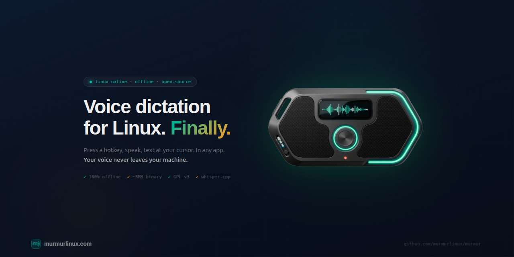

<p align="center">
  <a href="https://murmurlinux.com">
    
  </a>
</p>

<p align="center">
  <a href="https://github.com/murmurlinux/murmur/releases"></a>
  <a href="https://github.com/murmurlinux/murmur/blob/main/LICENSE"></a>
  <a href="https://github.com/murmurlinux/murmur/stargazers"></a>
  <a href="https://github.com/murmurlinux/murmur/issues"></a>
</p>

---

**Murmur** is a Linux-native voice-to-text desktop gadget. Hold a hotkey, speak, and text appears at your cursor — in any application. Powered by [whisper.cpp](https://github.com/ggerganov/whisper.cpp) for fast, accurate, 100% offline transcription.

No cloud. No account. No telemetry. Your voice never leaves your machine.

## How Murmur compares

| | Murmur | Vocalinux | Wispr Flow | Nerd Dictation |
|---|:---:|:---:|:---:|:---:|
| **Platform** | Linux | Linux | Mac, Win, iOS | Linux |
| **Processing** | 100% local | 100% local | Cloud | 100% local |
| **Engine** | whisper.cpp | whisper.cpp / VOSK | Proprietary | VOSK |
| **GUI** | Floating widget | GTK tray | Tray icon | None (CLI) |
| **Binary size** | ~5 MB | ~200 MB+ | ~50 MB | ~1 MB |
| **Memory** | ~50 MB | ~300 MB | ~800 MB | ~200 MB |
| **Stack** | Rust + Tauri | Python + GTK | Electron | Python |
| **Cost** | Free | Free | $144/yr | Free |

## Features

- **100% Offline** — whisper.cpp runs locally on your CPU. Zero network requests after model download.
- **Floating Comm Badge** — a desktop gadget with customisable skins and accent colours. Always visible, always ready.
- **Universal Text Injection** — types into any app via XTEST. Terminals, IDEs, browsers, chat — if it has a cursor, Murmur types into it.
- **Push-to-Talk** — configurable global hotkey. Hold to record, release to transcribe.
- **Multiple Models** — Tiny (75 MB, ~3s), Base (142 MB, ~8s), Small (466 MB, best accuracy). Choose your tradeoff.
- **Tiny Footprint** — ~5 MB binary, ~50 MB RAM. Built with Rust + Tauri 2. Starts in under a second.

## Quick Install

**AppImage (any distro):**

```bash
wget https://murmurlinux.com/latest.AppImage
chmod +x latest.AppImage
./latest.AppImage
```

**Debian / Ubuntu (.deb):**

```bash
wget https://murmurlinux.com/latest.deb
sudo dpkg -i latest.deb
```

> Requires: Linux (Ubuntu 22.04+, Fedora 38+, Arch), xdotool, PipeWire or PulseAudio

## Build from Source

```bash
# Prerequisites
sudo apt install libwebkit2gtk-4.1-dev libayatana-appindicator3-dev xdotool

# Clone and build
git clone https://github.com/murmurlinux/murmur.git
cd murmur
pnpm install
pnpm tauri build
```

The built binary will be in `src-tauri/target/release/murmur`.

## Usage

1. Launch Murmur — the Comm Badge widget appears on your desktop
2. Press your hotkey (default: `Ctrl+Shift+Space`) and hold
3. Speak naturally
4. Release — text appears at your cursor

### Configuration

Open settings via the gear icon on the Comm Badge:

- **Hotkey** — change the global shortcut
- **Model** — select Tiny, Base, or Small (auto-downloads on first use)
- **Accent colour** — customise the Comm Badge glow
- **Skin** — choose your widget style

Settings are stored in `~/.local/share/murmur/settings.json`.

## Tech Stack

| Component | Technology |
|-----------|-----------|
| Backend | Rust + Tauri 2 |
| Frontend | SolidJS + TypeScript |
| STT Engine | whisper.cpp (via whisper-rs) |
| Audio | cpal (PipeWire / PulseAudio) |
| Text Injection | xdotool (XTEST) |
| Build | Vite 6 + Cargo |

## Whisper Models

| Model | Size | Speed | Accuracy |
|-------|------|-------|----------|
| tiny.en | 75 MB | ~3-4s | Good |
| base.en | 142 MB | ~8-10s | Better |
| small.en | 466 MB | ~20-30s | Best |

Models auto-download from Hugging Face on first use. SHA256 verified.

## Roadmap

- [x] Core dictation + settings (v0.1.0)
- [ ] GPU acceleration (Vulkan)
- [ ] Wayland support (ydotool)
- [ ] Voice Activity Detection (tap-to-record)
- [ ] Additional skins
- [ ] Cloud STT option (Pro tier)
- [ ] CLI mode (`murmur-cli`)
- [ ] Multi-language support (99+ languages)

See the full [roadmap](https://murmurlinux.com/about) on our website.

## Contributing

We welcome contributions! See [CONTRIBUTING.md](CONTRIBUTING.md) for development setup, build instructions, and PR guidelines.

## License

[GPL-3.0](LICENSE) — free and open source. Read the code, verify the privacy claims, contribute features.

---

<p align="center">
  <a href="https://murmurlinux.com">Website</a> &nbsp;&middot;&nbsp;
  <a href="https://github.com/murmurlinux/murmur/issues">Issues</a> &nbsp;&middot;&nbsp;
  <a href="https://github.com/murmurlinux/murmur/discussions">Discussions</a>
</p>
